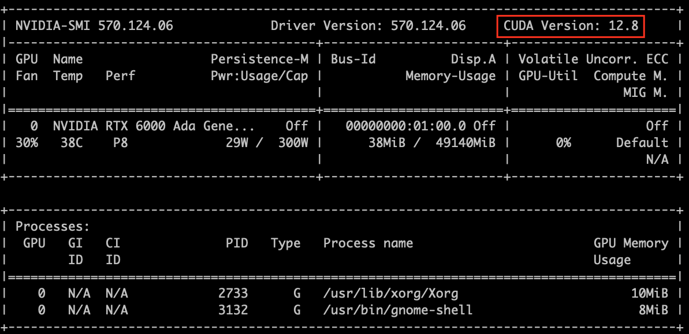
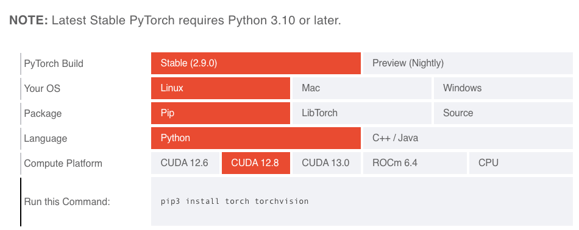

# LLM Demo
[Federated execution](src/federated_execution/) - For federated execution of this demo.
# Overview
This is a quiz-style game between two LLM agents. For each user question typed at the keyboard, both agents answer in parallel. The Judge announces whichever answer arrives first (or a timeout if neither responds within 60 sec), and prints per-question elapsed logical and physical times. 

# Pre-requisites 

You need Python installed, as llm.py is written in Python.

## Library Dependencies
To run this project, there are dependencies required which are in [requirements.txt](requirements.txt) file. The model used in this repository has been quantized using 4-bit precision (bnb_4bit) and relies on bitsandbytes for efficient matrix operations and memory optimization. So specific versions of bitsandbytes, torch, and torchvision are mandatory for compatibility. 
While newer versions of other dependencies may work, the specific versions listed below have been tested and are recommended for optimal performance.
It is highly recommended to create a Python virtual environment or a Conda environment to manage dependencies. \
To create the a virtual environment follow the steps below.

### Step 1: Creating environment
Replace this <> with the environment name
```
python3 -m venv <name of the environement> 
source <name of the environement>/bin/activate 
```
or
```
conda create -n <name of the environement> 
conda activate <name of the environement> 
```
### Step 2: Installing the required packages
Check if pip is installed:
```
pip --version
```
If it is not installed:
```
python -m pip install --upgrade pip
```
Run this command to install the packages from the [requirements.txt](requirements.txt) file:
```
pip install -r requirements.txt
```
For installing torch:

1. For devices without GPU
```
pip install torch torchvision
```
2. For devices with GPU
   Checking the CUDA version run this command:
   ```
   nvidia-smi
   ```
   Look for the line "CUDA Version" as shown in the image: \
    

   With the correct version install PyTorch from [PyTorch](https://pytorch.org/get-started/locally/) by selecting the right correct OS and compute platform as shown in the image below for Linux system with CUDA version 12.8: \
    
### Step 3: Model Dependencies  
- **Pre-trained Models used in the agents/llm.py**:  [meta-llama/Llama-2-7b-chat-hf](https://huggingface.co/meta-llama/Llama-2-7b-chat-hf) , [meta-llama/Llama-2-70b-chat-hf](https://huggingface.co/meta-llama/Llama-2-70b-chat-hf) \
**Note:** Follow the steps below to obtain the access and authentication key for the hugging face models.
1. Create the user access token and follow the steps shown on the official documentation: [User access tokens](https://huggingface.co/docs/hub/en/security-tokens)
2. Log in using the Hugging Face CLI by running huggingface-cli login. Please refer to the official documentation for step-by-step instructions - [HuggingFace CLI](https://huggingface.co/docs/huggingface_hub/en/guides/cli)
3. For the Llama Models you will require access to use the models if you are using it for the first time. Open these links and apply for accessing the models ([meta-llama/Llama-2-7b-chat-hf](https://huggingface.co/meta-llama/Llama-2-7b-chat-hf), [meta-llama/Llama-2-70b-chat-hf](https://huggingface.co/meta-llama/Llama-2-70b-chat-hf))

## System Requirements  

To ensure optimal performance, the following hardware and software requirements are utilized. \
**Note:** To replicate this model, you can use any equivalent hardware that meets the computational requirements.

### Hardware Requirements   
The demo was tested with the following hardware setup.
- **GPU**: NVIDIA RTX A6000  

### Software Requirements  
- **OS**: Linux
- **Python**   
- **CUDA Version**: 12.8  

Make sure the environment is properly configured to use CUDA for optimal GPU acceleration.

# Files and directories in this repository
  - **`llm_base_class.lf`** - Contains the base reactors LlmA, LlmB, Keyboard and Judge..
  - **`llm_quiz_game.lf`** - Lingua Franca program that defines the quiz game reactors (Keyboard input, LLM agent A, LLM agent B and Judge).

# Execution Workflow 

### Step 1: 
Run the **`llm_quiz_game.lf`**.  

**Note:**  
- Ensure that you specify the correct file paths

Run the following commands:  

```
lfc src/llm_quiz_game.lf
```

### Step 2: Run the binary file and input the quiz question
Run the following commands:  

```
./bin/llm_quiz_game
```

The system will ask for entering the quiz question which is to be obtained from the keyboard input.

Example output printed on the terminal:
 
<pre>

--------------------------------------------------
---- System clock resolution: 1 nsec
---- Start execution on Fri Sep 19 10:46:31 2025 ---- plus 772215861 nanoseconds
Enter the quiz question
What is the capital of South Korea?
Query: What is the capital of South Korea?

waiting...

Winner: LLM-B | logical 1184 ms | physical 1184 ms
Answer: Seoul.
--------------------------------------------------

</pre>

# Contributors
